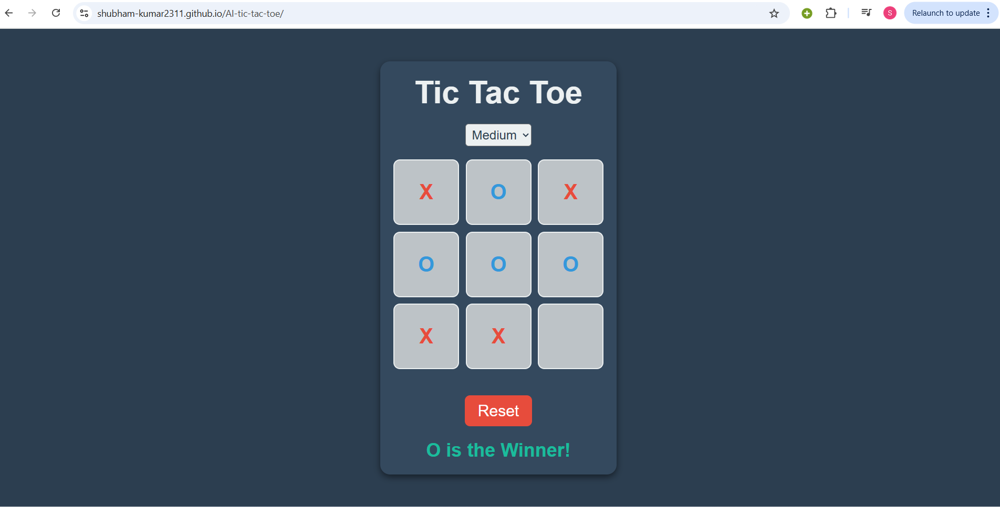

# 🎮 Tic Tac Toe with AI

A modern, browser-based Tic Tac Toe game featuring an intelligent AI opponent powered by the **Minimax algorithm with Alpha-Beta Pruning**. Designed with a sleek UI, responsive layout, and multiple difficulty levels, this project offers an engaging and strategic gameplay experience.

---

## 🚀 Live Demo  
🔗 [Play Now](https://shubham-kumar2311.github.io/AI-tic-tac-toe/)  
*Replace the above URL with your actual deployment link (e.g., GitHub Pages, Netlify, or Vercel)*

---

## 🖼️ Screenshot  
  
*Make sure this image exists at the specified path.*

---

## 🧠 Key Features

- **Smart AI Opponent**: Uses Minimax with Alpha-Beta Pruning for optimal move selection.
- **Three Difficulty Levels**:
  - 🟢 *Easy*: 70% random moves, shallow search depth.
  - 🟡 *Medium*: Balanced heuristic with depth 3.
  - 🔴 *Hard*: Aggressive strategy with depth 5.
- **Color-Coded Symbols**: "X" in red, "O" in blue for clarity.
- **Responsive Design**: Mobile-friendly layout with a modern dark theme.
- **Instant Reset**: Restart the game anytime with a click.
- **No Dependencies**: Pure HTML, CSS, and JavaScript — works out of the box.

---

## 🎮 How to Play

1. **Select Difficulty**: Choose from Easy, Medium, or Hard.
2. **Your Turn**: Click an empty cell to place your "X".
3. **AI Turn**: The AI responds with "O".
4. **Winning**: Align 3 identical symbols in a row, column, or diagonal.
5. **Draw**: The board is full with no winner.
6. **Reset**: Click the "Reset" button to start a new match.

---

## 🧪 AI Strategy & Heuristics

- **Minimax with Alpha-Beta Pruning**: Efficiently finds the optimal move by pruning unneeded branches.
- **Heuristic Evaluation**:
  - Considers potential win/block moves.
  - Adjusts behavior based on difficulty level.
